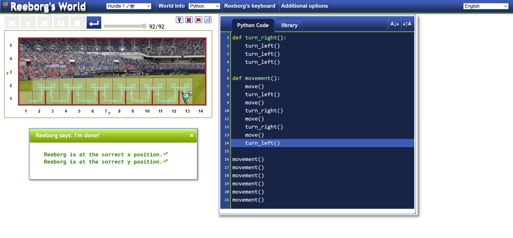
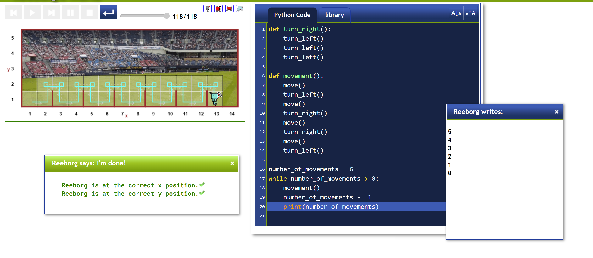
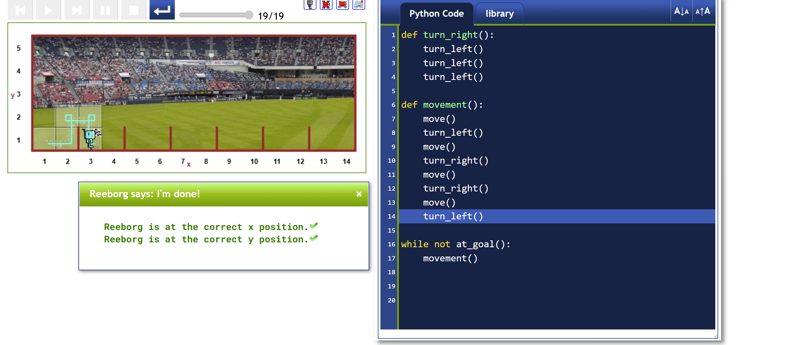
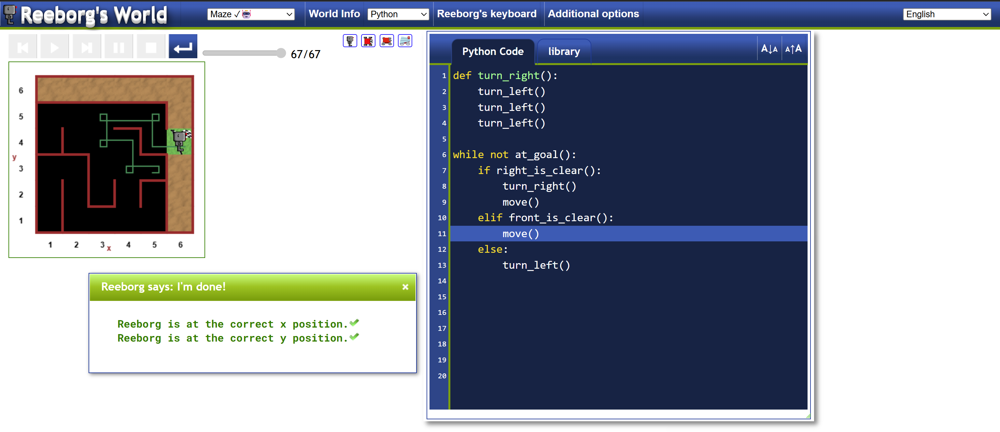

# 🧠 Python Functions, Indentation & Loops

---

## 🔧 What is a Function?

A **function** is a block of reusable code designed to perform a specific task.

### 🛠️ Built-in Functions:
```python
print("Hello")    # Prints to console
len("Python")     # Returns the length
```

### 🧱 Creating Your Own Function:
```python
def my_function():
    print("Hello")
    print("Bye")
```

To **execute** a function, you must call it:

```python
my_function()
```

### ✅ Function Syntax Structure:
```python
def my_function():
    # Do this
    # Then do this
    # Finally do this
```

### 🧪 Practice Functions Here:
[Reeborg's World for Python](https://reeborg.ca/reeborg.html?lang=en&mode=python&menu=worlds%2Fmenus%2Freeborg_intro_en.json&name=Alone&url=worlds%2Ftutorial_en%2Falone.json)

---

## 📏 Indentation in Python

Indentation helps define **code blocks** in Python. It is **mandatory** and indicates which lines of code belong together.

### Example:
```python
def my_function():
    print("Hi")  # <- This space is indentation

if sky == "BLUE":
    print("Good to go out")
elif sky == "DARK":
    print("May be rainy")
```

🧠 **Tip:** 1 tab = 4 spaces. Be consistent with indentation to avoid errors.

---

## 🔁 `while` Loop

The `while` loop executes code **as long as a condition is true**.

### 🌀 Example:
```python
a = 6
while a > 0:
    print("HELLO WORLD")
    a -= 1
    print(a)
```

---

## 🔁 `for` vs `while` Loop

| Use Case     | Loop Type | Explanation                               |
|--------------|-----------|-------------------------------------------|
| Known range  | `for`     | Use when looping over a defined sequence. |
| Unknown end  | `while`   | Use when repeating until a condition fails.|

---

## 🖼️ Diagrams & Visuals

### 📌 Function Diagram:


### 🔁 While Loop Flow:



---

## 🧪 Final Project Preview



---

## ✅ Summary

- **Functions** let you reuse blocks of code.
- **Indentation** is mandatory and defines structure.
- **`while` loops** repeat as long as a condition holds true.
- Practice platforms like **Reeborg** help cement logic skills.

Happy coding! 🐍🚀


