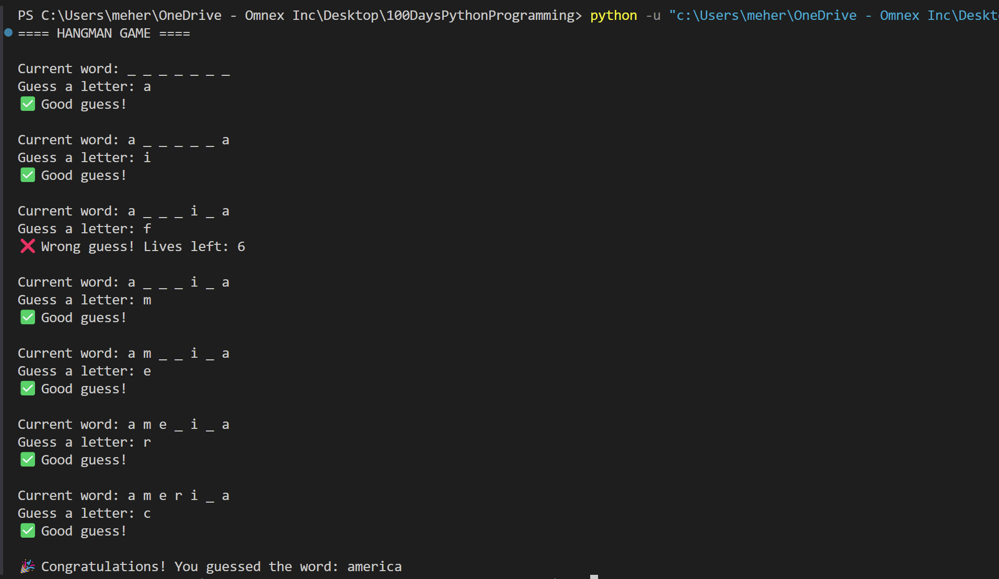

# 🪢 Hangman Game (Python CLI)

A classic **Hangman word guessing game** built using basic Python constructs like loops, conditionals, and lists. The user guesses letters one at a time to reveal a hidden word within a limited number of attempts (lives). A fun way to practice string manipulation and control flow!

---

## 🎮 Play Online First (Optional)

Want to experience how the Hangman game works before coding it? Try it here:

🔗 [Play Hangman on Poki](https://poki.com/en/g/hangman)

---

## 🧠 Game Flow

- A random word is chosen from a predefined list.
- The user is shown blanks (`_`) representing the letters of the word.
- For each turn:
  - The user inputs one letter.
  - If the guess is correct, the letter is revealed in all its positions.
  - If incorrect, the number of lives decreases.
- The game continues until:
  - The user guesses the word (🎉 Win)
  - OR the user runs out of lives (💀 Game Over)

---

## 📊 Flowchart

This flowchart outlines the logic of the game:


---

## 🖥️ Sample Output

Below is a screenshot of what the game looks like during play:



---

## 💡 Features

- Random word selection from a list
- Input validation (only single letters allowed)
- Tracks previously guessed letters
- Displays progress after each guess
- Win/Lose message

---

## 🚀 How to Run

1. Make sure Python is installed.
2. Save the script as `hangman.py`.
3. Open terminal/command prompt.
4. Run the game:

```bash
python hangman.py
