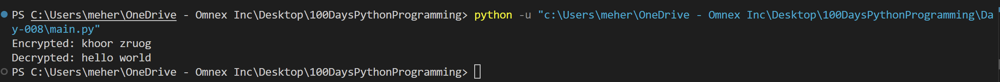

# 🔐 Caesar Cipher & Python Function Basics

This repository contains beginner-friendly Python scripts that demonstrate:

- Encrypting and decrypting text using the **Caesar Cipher** algorithm
- Writing functions with **positional and keyword arguments**
- Understanding function calls and parameter handling in Python

---

## 🧠 Topics Covered

1. **Functions**
2. **Positional Arguments**
3. **Keyword Arguments**
4. **Caesar Cipher (Encryption & Decryption)**

---

## 🔐 Caesar Cipher – Encode & Decode Messages

A simple implementation of the Caesar Cipher where each letter in the original message is **shifted by a certain number of positions** in the alphabet.

---

🙋‍♂️ Functions with Arguments
Demonstrates how to pass values to functions and print dynamic greetings.
def greet(name):
    print(f"Hello, {name}")
    print("How do u do?")
    print("How's the weather?")

greet("Arya")
▶️ Output:
Hello, Arya
How do u do?
How's the weather?

📍 Positional vs Keyword Arguments
Examples of passing multiple parameters using both positional and keyword formats:
def greet(name, location):
    print(f"Myself is {name}")
    print(f"I am from {location}")

# Positional arguments
greet("Arya", "VJA")

# Keyword arguments
greet(location="VJA", name="Arya")
📌 Positional arguments must be in correct order
✅ Keyword arguments can be passed in any order

----
Sample result

