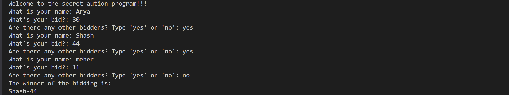

# -------------------------------------------
# 📘 PYTHON DICTIONARIES - COMPLETE GUIDE
# -------------------------------------------

# ✅ What is a dictionary?
# A dictionary stores data as key-value pairs.
# Keys must be unique and are used to access corresponding values.

example = {
    "Roll_no_1": "Vidya",
    "Roll_no_2": "Sammy",
    "Roll_no_3": "Groovy"
}

# ✅ Accessing values using keys
print(example["Roll_no_1"])  # Output: Vidya

# ⚠️ If the key doesn't exist, you'll get a KeyError
# print(example["Roll_no_5"])  # Uncommenting this will raise an error

# ✅ Adding a new item to the dictionary
example["Roll_no_4"] = "Lekha"
print(example)

# ✅ Updating the value of an existing key
example["Roll_no_1"] = "Samant"  # Changes Vidya to Samant
print(example)

# ✅ Deleting the entire dictionary
# del example  # This will delete the entire 'example' dictionary

# ✅ Creating an empty dictionary
empty_dict = {}
print(empty_dict)  # Output: {}

# ✅ Looping through keys in a dictionary
for key in example:
    print(f"Key: {key}, Value: {example[key]}")

# -------------------------------------------
# 🔁 NESTING IN DICTIONARIES
# -------------------------------------------

# A dictionary can have lists or other dictionaries as values.

# 📍 Example 1: Dictionary with list as value
travel_log = {
    "France": ["Paris", "Lille", "Dijon"],
    "India": ["Delhi", "Mumbai"]
}
print(travel_log["France"][1])  # Output: Lille (2nd city in France list)

# 📍 Example 2: Nested list inside a list
nested_list = [1, 2, [3, 4]]
print(nested_list[2][1])  # Output: 4 (2nd element of nested list at index 2)

# 📍 Example 3: Dictionary inside a dictionary
travel_log = {
    "France": {
        "cities_visited": ["Paris", "Lille", "Dijon"],
        "total_visits": 12
    },
    "Germany": {
        "cities_visited": ["Berlin", "Munich", "Hamburg"],
        "total_visits": 10
    }
}
# Accessing nested dictionary values
print(travel_log["Germany"]["cities_visited"][0])  # Output: Berlin
print(travel_log["France"]["total_visits"])        # Output: 12

# 🧠 Summary:
# - Dictionaries use key-value pairs.
# - You can add, edit, or delete items using keys.
# - Values can be of any data type including lists and other dictionaries.
# - Nested dictionaries help organize complex data structures.

------------
main.py final result
-------------

