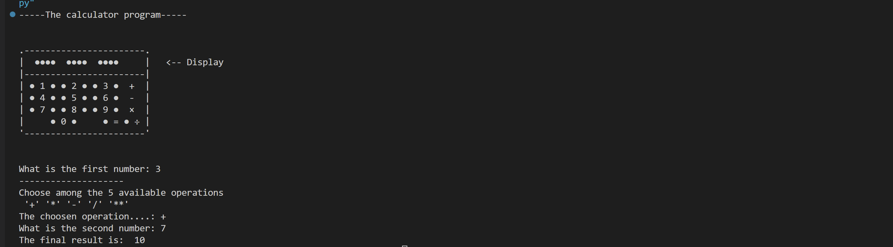
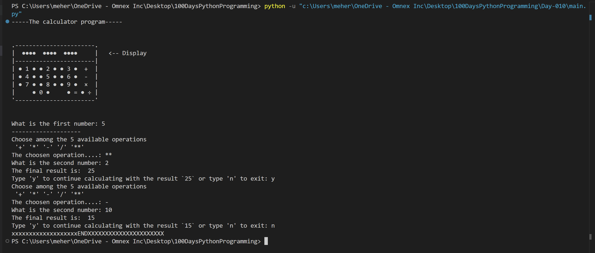

"""
This script demonstrates:
- Functions with return values
- Functions with parameters
- Title-case conversion
- Function chaining (output of one function as input to another)
- Use of docstrings for documentation
"""

# -----------------------------------
# 1. Function with return (no input)
# -----------------------------------
def add():
    """Returns a fixed sum of 2 + 3"""
    return 2 + 3

# Call: add() → Output: 5

# ---------------------------------------------------------
# 2. Function with required parameters: f_name, l_name
# ---------------------------------------------------------
def format_name(f_name, l_name):
    """
    Formats the given first and last name into title case and returns the full name.

    Args:
        f_name (str): First name
        l_name (str): Last name

    Returns:
        str: Full name in title case
    """
    f_name = f_name.title()  # Converts to Title Case (e.g., "john" -> "John")
    l_name = l_name.title()
    return f"{f_name} {l_name}"

# Example Call:
# format_name("Ander", "sens") → Output: "Ander Sens"

# -----------------------------------------
# 3. String Title-Case Conversion Example
# -----------------------------------------
# Example: "hello world" → "Hello World"

# -----------------------------------------------
# 4. Function Composition / Chaining Scenario
# -----------------------------------------------

def function_1(text):
    """Duplicates the input string."""
    return text + text

def function_2(text):
    """Converts the input string into title case."""
    return text.title()

# Function chaining
output = function_2(function_1("above"))
print(output)  # Output: Aboveabove

# Explanation:
# function_1("above") → "aboveabove"
# function_2("aboveabove") → "Aboveabove"

# -----------------------
# 5. Docstring Format
# -----------------------
"""
Docstrings (written in triple quotes) are used to document:
- Classes
- Functions
- Modules

They help explain what the code does, its parameters, and expected outputs.
"""

## Project outcome

## Updated outcome with recursive usage.
