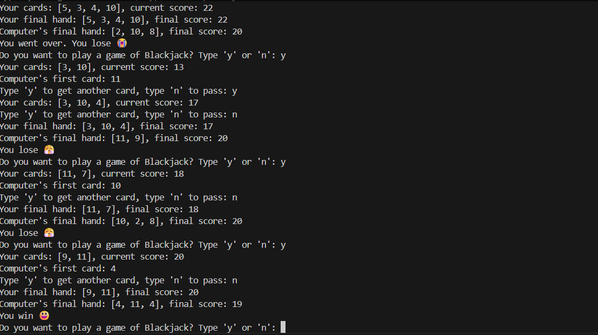

# Day 11 - Blackjack Game

A simple command-line Blackjack project written in Python.

This project simulates a basic Blackjack game where you play against the computer. The goal is to get as close to 21 as possible without going over.

## Project Overview

This program:

- deals two cards to the player and two cards to the computer
- lets the player choose whether to draw another card or stop
- makes the computer draw until its score reaches at least 17
- compares final scores and prints the result

It is a beginner-friendly Python project focused on conditionals, functions, lists, loops, and game logic.

## Features

- Random card dealing using Python's `random` module
- Blackjack detection
- Automatic Ace adjustment from `11` to `1` when needed
- Dealer logic based on standard simplified Blackjack rules
- Final result comparison between player and computer

## Rules Used In This Version

- Cards are chosen randomly from a fixed list of card values
- `11` represents an Ace
- `10` is used for `10`, `Jack`, `Queen`, and `King`
- A two-card `21` is treated as Blackjack
- The dealer keeps drawing until the score is `17` or more
- Cards are not removed from the deck after being drawn

## Technologies

- Python 3
- Standard library only

## How To Run

1. Make sure Python is installed.
2. Open a terminal in the `Day-011` folder.
3. Run:

```bash
python main.py
```

## Example Gameplay

```text
Your cards: [10, 7], current score: 17
Computer's first card: 9
Type 'y' to get another card, type 'n' to pass: n
Your final hand: [10, 7], final score: 17
Computer's final hand: [9, 8], final score: 17
Draw
```

## What I Practiced

- Writing reusable functions
- Managing program flow with loops and conditions
- Working with lists to store cards
- Building simple game logic in Python
- Comparing scores and handling edge cases

## Possible Improvements

- Add a replay option so the game can run multiple rounds
- Clear the screen between turns for better readability
- Improve the card system to use a real deck structure
- Add input validation for unexpected user responses
- Refactor the game into smaller functions for cleaner structure

## Author

Created as part of a Python learning challenge.

## Sample Working Output

