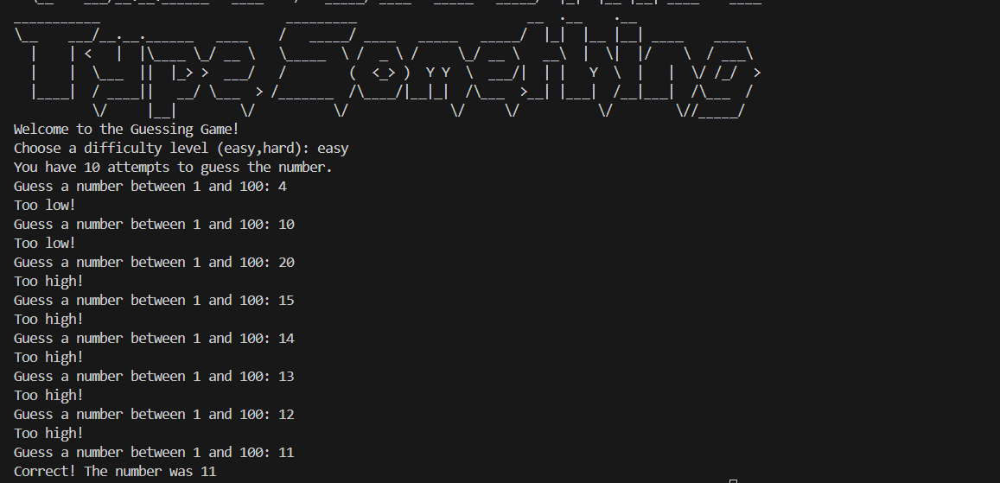
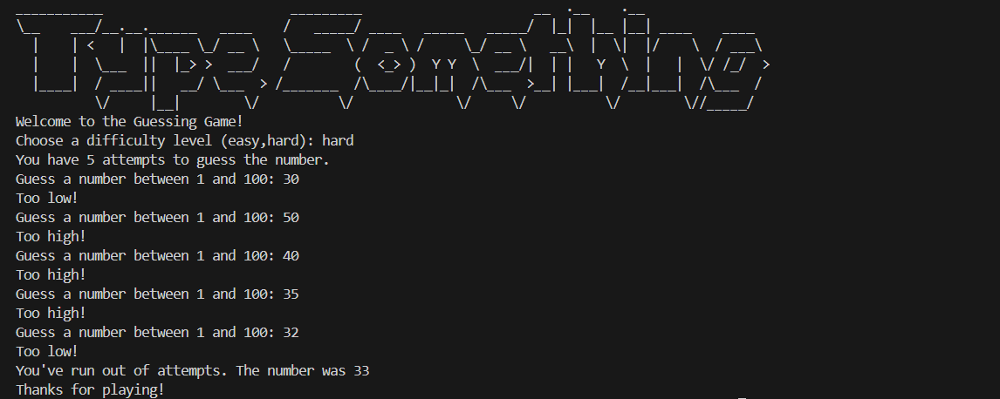
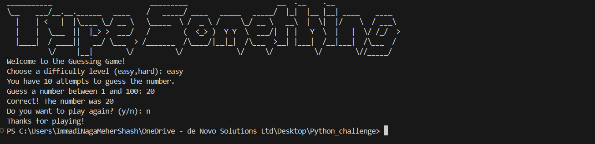

# Day 12 - Number Guessing Game

A fun command-line Python game where the player tries to guess a secret number between 1 and 100.

---

## Game Idea

The computer chooses a random number.
You choose a difficulty level:
- Easy: 10 attempts
- Hard: 5 attempts

After every guess, the game gives feedback:
- Too low
- Too high
- Correct

The game ends when:
- You guess the correct number, or
- You run out of attempts

---

## Why This Project Is Important

This project is a great beginner challenge because it combines:
- Random number generation
- User input handling
- Conditional logic
- Loop control
- Game state management

It teaches how real programs keep running, react to user actions, and stop at the right moment.

---

## The Importance of the While Loop

The while loop is the heart of this game.

Without a while loop, the program could only ask for one guess and then stop. But a guessing game needs repeated attempts.

In this project, the while loop controls the full game cycle:
- It keeps the game running while the guess is not correct
- It also checks that attempts are still available
- It exits automatically when either condition fails

This creates a clean game rule in one line of logic:
Continue playing while the player has attempts and has not guessed correctly.

In short, the while loop turns simple input/output into an actual interactive game.

---

## How The Game Was Built

### 1) Set up the secret number
The game uses Python random functions to generate a number from 1 to 100.

### 2) Ask for difficulty
The player chooses easy or hard mode, and attempts are set based on that choice.

### 3) Start the loop
The while loop begins and handles repeated guesses.

### 4) Compare and respond
Each guess is compared with the secret number, and feedback is shown.

### 5) Update attempts
Wrong guesses reduce attempts.

### 6) End conditions
The game ends with either a success message or a game-over message.

---

## Project Flow

Start game
  -> choose difficulty
  -> set attempts
  -> while not correct and attempts > 0
      -> get guess
      -> compare with secret number
      -> show hint
      -> reduce attempts if wrong
  -> show final result

---

## How To Run

1. Open a terminal in the Day-012 folder.
2. Run:
    python main.py

---

## Sample Round

Welcome to the Guessing Game!
Choose a difficulty level (easy,hard): easy
You have 10 attempts to guess the number.
Guess a number between 1 and 100: 60
Too high!
Guess a number between 1 and 100: 30
Too low!
Guess a number between 1 and 100: 42
Correct! The number was 42

---

## Skills Practiced

- Designing game logic step by step
- Writing conditions for multiple outcomes
- Managing repeated actions with a while loop
- Tracking attempts with variables
- Building a complete playable CLI game

---

## Future Improvements

- Add input validation for non-numeric values
- Add replay mode to play multiple rounds
- Add score tracking across rounds
- Offer medium difficulty mode
- Improve terminal visuals with separators and colors

---

## Author

Built as part of a Python challenge journey, Day 12.

---
## Sample run Outputs   

