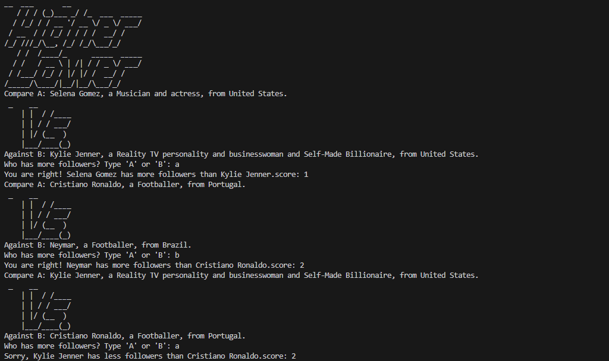

# Higher or Lower Game

This project is a Python-based command-line game inspired by the classic Higher or Lower challenge. The player is shown two accounts and must guess which one has more followers.



## How to Play

1. Run the game with Python:
   ```bash
   python main.py
   ```
2. The program displays two options, such as "Compare A" and "Against B".
3. Enter `A` or `B` to choose the account with more followers.
4. If your guess is correct, your score increases.
5. The game ends when you make a wrong guess.

## Objective

The goal is to keep making correct predictions and achieve the highest possible score.

## Project Files

- `main.py` – Contains the game logic, loops, and user interaction.
- `game_data.py` – Stores the list of profiles and follower counts used in the game.
- `image.png` – Screenshot of the game interface.

## Requirements

- Python 3.x

## Example Flow

```text
Compare A: Instagram, a Social media platform, from United States.

Against B: Cristiano Ronaldo, a Footballer, from Portugal.
Who has more followers? Type 'A' or 'B': a
You are right! Instagram has more followers than Cristiano Ronaldo. score: 1
```

## Notes

This game is a fun beginner-friendly exercise in Python that demonstrates:

- random selection
- conditional logic
- loops
- input handling
- score tracking

