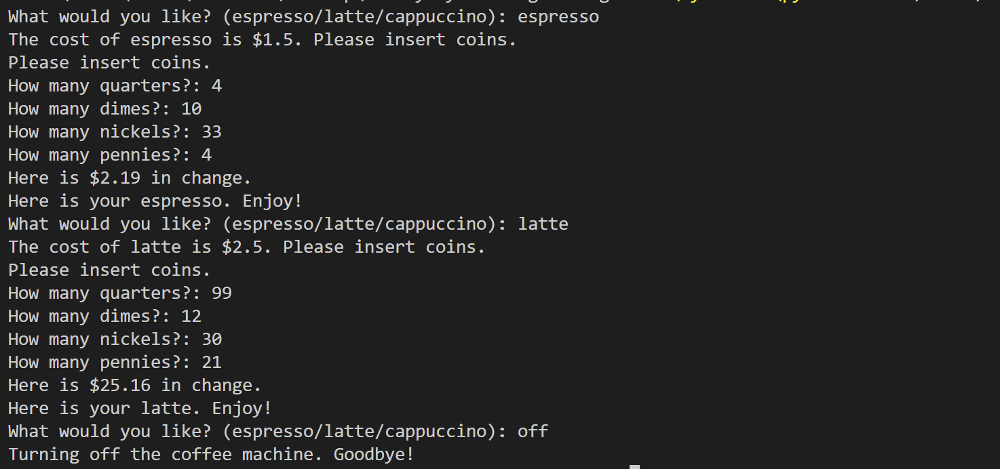
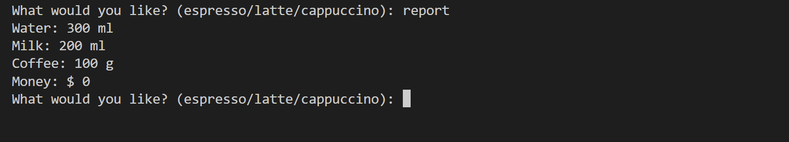

# Coffee Machine

This project is an interactive command-line coffee machine written in Python. It lets users choose a drink, insert coins, receive change, and keeps track of the available ingredients and profit.

## How to Run

From the `Day-015` directory, run:

```bash
python main.py
```

The program also requires `menu.py`, which contains the drinks and starting resources.

## Available Drinks

| Drink | Cost |
| --- | ---: |
| Espresso | $1.50 |
| Latte | $2.50 |
| Cappuccino | $3.00 |

## Commands

- Enter `espresso`, `latte`, or `cappuccino` to order a drink.
- Enter `report` to view the remaining water, milk, coffee, and current profit.
- Enter `off` to shut down the coffee machine.

When ordering a drink, enter the number of quarters, dimes, nickels, and pennies requested by the program. The machine checks the ingredient supply, processes the payment, returns change, and prepares the coffee when the transaction succeeds.

## Concepts Practiced

- functions and docstrings
- dictionaries and nested dictionaries
- loops and conditional statements
- user input and type conversion
- resource tracking and payment processing

## Project Files

- `main.py` - Contains the coffee machine logic and user interaction.
- `menu.py` - Stores the drink menu, ingredient requirements, prices, and starting resources.

## Requirements

- Python 3.x



